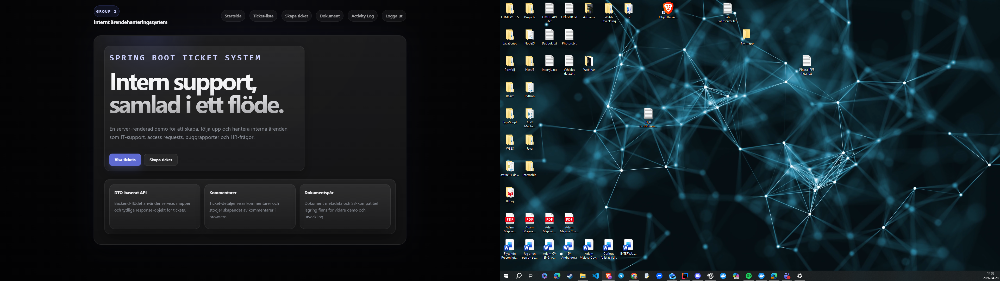

# Project Backend Group 1

Ett Spring Boot-baserat internt ärendehanteringssystem för företag. Projektet använder PostgreSQL som databas och Docker Compose för lokal utveckling.

### Dashboard


## Lokal uppstart

### Förutsättningar
- Java 25
- Docker
- Docker Compose
- Maven Wrapper (`mvnw` / `mvnw.cmd`)

### Databas
Projektet innehåller en lokal PostgreSQL-databas via [compose.yml](C:\Users\adam_\Desktop\Java\project-backend-grupp-1\compose.yml).

Starta databasen:

```bash
docker compose up -d
```

Kontrollera att containern är igång:

```bash
docker compose ps
```

Standardvärden för databasen:
- host: `localhost`
- port: `5432`
- database: `project_dev`
- username: `project`
- password: `project`

Exempelvärden finns i [.env.example](C:\Users\adam_\Desktop\Java\project-backend-grupp-1\.env.example).

### Spring Boot-applikationen
Spring-konfigurationen ligger i [application.properties](C:\Users\adam_\Desktop\Java\project-backend-grupp-1\src\main\resources\application.properties) och läser databaskopplingen från miljövariabler med default-värden för lokal utveckling.

Starta applikationen med Maven Wrapper:

På Windows:

```powershell
.\mvnw.cmd spring-boot:run
```

På macOS/Linux:

```bash
./mvnw spring-boot:run
```

### Miljövariabler
Om du vill använda andra databasvärden än standard kan dessa sättas lokalt:

- `DB_HOST`
- `DB_PORT`
- `DB_NAME`
- `DB_USERNAME`
- `DB_PASSWORD`

Om inga miljövariabler sätts används:

```properties
DB_HOST=localhost
DB_PORT=5432
DB_NAME=project_dev
DB_USERNAME=project
DB_PASSWORD=project
```

### Steg för steg
1. Starta databasen med `docker compose up -d`
2. Kontrollera att PostgreSQL-containern är igång med `docker compose ps`
3. Starta Spring Boot-appen med `.\mvnw.cmd spring-boot:run` eller `./mvnw spring-boot:run`
4. Om du använder andra databasvärden, sätt motsvarande `DB_*`-miljövariabler innan du startar appen

### Felsökning
Om appen inte kan nå databasen:

- kontrollera att Docker Desktop är igång
- kör `docker compose ps` och verifiera att `postgres` körs
- kontrollera att port `5432` inte redan används av en annan lokal PostgreSQL-instans
- kontrollera att dina `DB_*`-miljövariabler matchar värdena i Compose-konfigurationen
- starta om databasen med `docker compose down` följt av `docker compose up -d`
